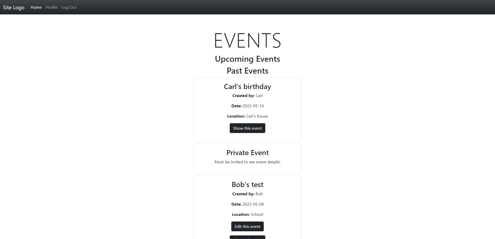

# Private Events

This is a web application that allows users to sign up, create private events, invite users to events, and RSVP to events that they're invited to.

## How It's Made:

**Tech Used:** Ruby, Rails, HTML, CSS(Bootstrap), JS, (React will be added) 

There's still some work to be done, not the least of which is updating the UI with React. Rails made it relatively easy to set up all the associations between users, events, invitations, and so forth. So far, I have very basic Bootstrap styling, and I look forward to expanding on that to make the app look and feel great.

## Lessons Learned

I learned that I **LOVE** planning out associations and databases. Rails' Active Record does a lot of the heavy lifting, and makes it incredibly satisfying to interact with my models. I made good use of my whiteboard to map out the relationships between my different models, and used the Annotate gem to display them in the model files.
